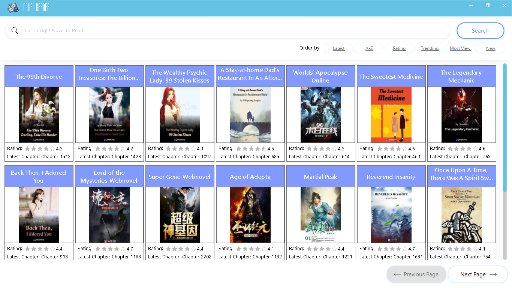
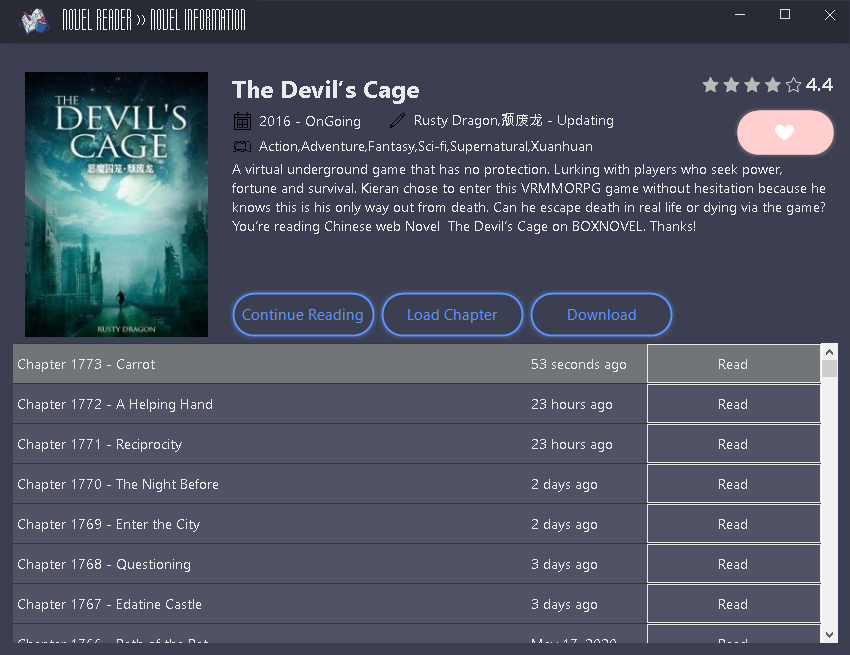
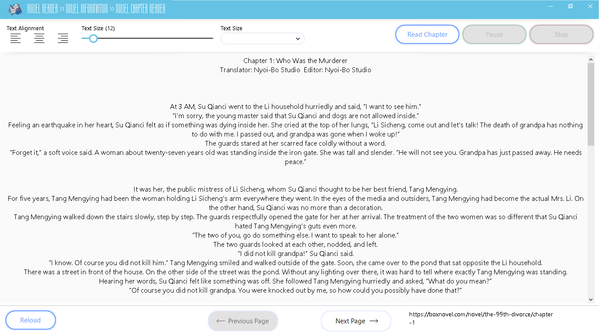

  

<h1 align="center">Light/Web Novel Reader Desktop Application</h1>

## Novel Reader
A Light Novel or Web Novel Reader for Windows/Desktop, this app use webscrapping for getting data to website showing it to the app. Download the pre-release version [NovelReader v2.zip](https://github.com/Keumjoh/NovelReader/files/4605519/NovelReader.v2.zip) - [Another Link](https://sourceforge.net/projects/light-web-novelreader/files/latest/download)

Website Source
 - [BoxNovel](https://boxnovel.com/)
 - [Wuxiaworldsite](https://Wuxiaworld.site/)
 - Adding more source on the feature.

## Interface

  

  

  

## Features
I'm still working on needed features such as favorite, recent/history, download etc

 - Search with ordery by filter
 - Displaying novel information
 - Changing font size and font
 - Text alignment
 - Text-to-speech
 
 ## Built With

* [GUNA Framework](https://gunaframework.com/) - The .Net Framework used
* [HtmlAgilityPack](https://html-agility-pack.net/) - Data Webscrapping
